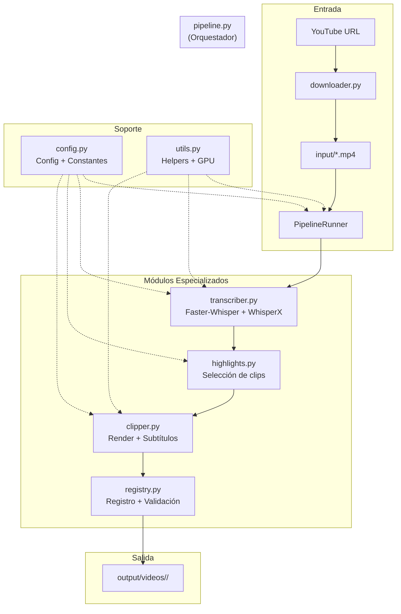

# Arquitectura del Proyecto - clipping-Alfa

## Vista General

Pipeline modular para convertir vídeos largos en clips verticales con subtítulos.

## Diagrama de Arquitectura

## Módulos

| Módulo | Responsabilidad |
|--------|----------------|
| `pipeline.py` | Orquestación, CLI, gestión de estados |
| `transcriber.py` | Transcripción (faster-whisper) + Alineación (WhisperX) |
| `highlights.py` | Selección de clips (heurísticas + futuro LLM) |
| `clipper.py` | Render vertical 9:16 + Subtítulos ASS + Validación visual |
| `registry.py` | Registro transaccional, SHA-256, processed_videos.v2.json |
| `config.py` | Configuración tipada, constantes, rutas |
| `utils.py` | Helpers: FFmpeg, logging, GPU, IO atómico |
| `downloader.py` | Descarga de YouTube con yt-dlp |

## Flujo Principal

1. **Entrada**: Vídeo en `input/` o URL de YouTube
2. **Transcripción**: faster-whisper en GPU
3. **Alineación**: WhisperX para timestamps por palabra
4. **Selección**: Heurísticas (o LLM) para elegir mejores momentos
5. **Render**: FFmpeg vertical 1080x1920 + subtítulos ASS
6. **Validación**: Control de calidad visual negativo
7. **Salida**: `output/videos/<id>/` con todos los assets

## Estado del Proyecto

- ✅ Arquitectura modular (8 módulos)
- ✅ 36/36 tests pasando
- ✅ Legacy archivado en `scripts/legacy/`
- ✅ Integración YouTube con yt-dlp (downloader.py)

