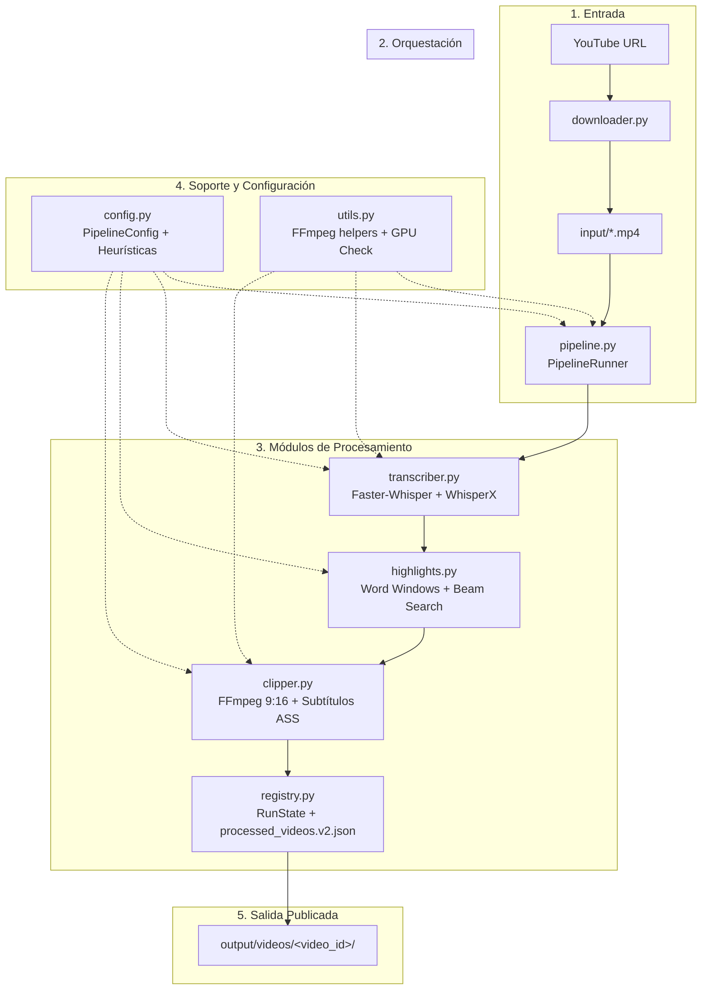

# clipping-Alfa - Pipeline de automatización de clips verticales


Pipeline modular local en Python para transformar automáticamente vídeos largos o enlaces de YouTube en clips verticales optimizados (9:16, 1080x1920) con subtítulos dinámicos estilo karaoke sincronizados palabra por palabra. Diseñado con arquitectura tolerante a fallos, publicación atómica y validación de calidad visual.

---

## Características Principales

- ✅ **Transcripción robusta:** Procesamiento de audio con Faster-Whisper (`small` en GPU/FP16) y validación anti-alucinaciones.
- ✅ **Alineación fonética:** Timestamps precisos por palabra mediante WhisperX sin re-transcribir el audio.
- ✅ **Selección inteligente de clips:** Heurística avanzada sobre palabras alineadas y optimización sin solapamientos con *beam search*.
- ✅ **Render vertical 9:16:** Recorte y escalado a 1080x1920 mediante FFmpeg (`libx264`, AAC 128k).
- ✅ **Subtítulos dinámicos ASS:** Efecto karaoke interactivo (`\k`) y posicionamiento configurable.
- ✅ **Descarga directa de YouTube:** Integración nativa con `yt-dlp` en máxima calidad.
- ✅ **Validación visual con control negativo:** Comprobación por análisis de píxeles raw que valida que los subtítulos sean legibles frente al ruido de compresión.
- ✅ **Registro transaccional y caché:** Deduplicación basada en SHA-256 de archivos fuente y huella de configuración (`processed_videos.v2.json`).
- ✅ **Suite de pruebas:** 36/36 tests unitarios y de integración automatizados.

---

## Arquitectura

El pipeline opera de forma modular desacoplando las etapas de IA, renderizado, orquestación y estado:



### Módulos del Sistema

| Módulo | Responsabilidad |
|:---|:---|
| `scripts/pipeline.py` | Orquestación general, CLI y ciclo de vida de ejecución. |
| `scripts/downloader.py` | Descarga de vídeos de YouTube con `yt-dlp`. |
| `scripts/transcriber.py` | Transcripción (Faster-Whisper) y alineación fonética (WhisperX). |
| `scripts/highlights.py` | Generación de ventanas temporales, scoring y selección por beam search. |
| `scripts/clipper.py` | Renderizado vertical 9:16, subtítulos ASS y control visual negativo. |
| `scripts/registry.py` | Transacciones en `.work/`, cálculo de SHA-256 y registro v2. |
| `scripts/config.py` | Configuración tipada (`PipelineConfig`), rutas, constantes y excepciones. |
| `scripts/utils.py` | Envoltorios de FFmpeg/ffprobe, logging, verificación de CUDA y E/S atómica. |

---

## Instalación

### 1. Clonar el repositorio
```bash
git clone https://github.com/gfromtheD/clipping-Alfa.git
cd clipping-Alfa
```

### 2. Crear y activar el entorno virtual
```powershell
python -m venv .venv
.\.venv\Scripts\Activate.ps1
```

### 3. Instalar dependencias
```bash
pip install -r requirements.txt
```

> **Nota:** Se requiere `ffmpeg` y `ffprobe` instalados en el sistema y disponibles en el `PATH`, compilados con soporte para `libass`.

### 4. Verificar GPU (Opcional pero recomendado)
```powershell
python -c "import torch; print('CUDA Disponible:', torch.cuda.is_available())"
```

---

## Uso Básico

```powershell
# 1. Procesar todos los vídeos en la carpeta input/
python scripts/process_video.py --language auto

# 2. Procesar un vídeo local específico en español
python scripts/process_video.py --input input/mi_video.mp4 --language es

# 3. Descargar desde YouTube y procesar directamente
python scripts/process_video.py --youtube-url "https://www.youtube.com/watch?v=dQw4w9WgXcQ" --language en

# 4. Especificar modelo Whisper y parámetros de GPU
python scripts/process_video.py --youtube-url "https://youtu.be/dQw4w9WgXcQ" --model small --device cuda --compute-type float16
```

---

## Estructura del Proyecto

```
clipping-Alfa/
├── scripts/
│   ├── process_video.py   # Punto de entrada principal
│   ├── pipeline.py        # Orquestador del flujo
│   ├── downloader.py      # Módulo de descarga YouTube (yt-dlp)
│   ├── transcriber.py     # Transcripción y alineación
│   ├── highlights.py      # Heurística y selección de clips
│   ├── clipper.py         # Render 9:16 y subtítulos ASS
│   ├── registry.py        # Registro transaccional y deduplicación
│   ├── config.py          # Constantes y PipelineConfig
│   ├── utils.py           # Utilidades de sistema, FFmpeg y GPU
│   └── legacy/            # Scripts archivados de versiones previas
├── input/                 # Carpeta de vídeos de entrada
├── output/                # Directorio de resultados inmutables (output/videos/<id>/)
├── tests/                 # Tests unitarios y de integración
│   ├── test_logic.py
│   └── test_integration.py
├── ARCHITECTURE.md        # Documentación de arquitectura
├── requirements.txt       # Dependencias principales
├── requirements.lock.txt  # Lockfile de entorno congelado
└── README.md
```

---

## Configuración Avanzada

| Parámetro CLI | Descripción | Valor por defecto |
|:---|:---|:---|
| `--input` | Ruta a un archivo de vídeo específico. Si se omite, busca en `input/`. | `None` |
| `--youtube-url` | URL de YouTube para descargar y procesar automáticamente. | `None` |
| `--language` | Idioma esperado (`es`, `en`, etc.) o `auto` para autodetección. | `auto` |
| `--device` | Dispositivo de cómputo para IA (`cuda` o `cpu`). | `cuda` |
| `--compute-type` | Precisión de cómputo (`float16`, `float32`, `int8`). | `float16` |
| `--model` | Modelo de Faster-Whisper (`tiny`, `base`, `small`, `medium`, `large-v3`). | `small` |
| `--min-duration` | Duración mínima de cada clip en segundos. | `18.0` |
| `--max-duration` | Duración máxima de cada clip en segundos. | `45.0` |
| `--max-clips` | Número máximo de clips no solapados a generar. | `8` |
| `--subtitle-margin-ratio` | Margen inferior relativo para la posición de los subtítulos (0.05 - 0.45). | `0.27` |
| `--crf` | Factor de calidad visual constante para codificación H.264. | `23` |
| `--preset` | Preset de velocidad de codificación FFmpeg (`veryfast`, `medium`, etc.). | `veryfast` |
| `--prune-work-days` | Días de inactividad para purgar carpetas huérfanas en `output/.work` (0 = desactivado). | `0` |

---

## Tests

El proyecto incluye tests de lógica pura y tests de integración con generación sintética de vídeo y dobles de IA:

```powershell
# Ejecutar toda la suite de tests
.\.venv\Scripts\python.exe -m unittest discover -s tests -v
```

---

## Roadmap

- [ ] **Selección semántica con LLM:** Módulo para puntuación narrativa y ganchos mediante LLM local/API.
- [ ] **Smart Crop con seguimiento facial:** Reencuadre dinámico de oradores con MediaPipe / YOLO.
- [ ] **Aceleración por GPU en FFmpeg:** Exportación con `h264_nvenc`.
- [ ] **Interfaz Gráfica / Web:** Panel interactivo en Streamlit o Gradio.

---

## Licencia y Créditos

Este proyecto se distribuye bajo la licencia MIT.

### Agradecimientos y Tecnologías
- [faster-whisper](https://github.com/SYSTRAN/faster-whisper) - Motor de transcripción acelerado.
- [WhisperX](https://github.com/m-bain/whisperX) - Alineación fonética por palabra.
- [yt-dlp](https://github.com/yt-dlp/yt-dlp) - Descarga robusta de fuentes multimedia.
- [FFmpeg](https://ffmpeg.org/) - Procesamiento de vídeo y renderizado de subtítulos ASS.
