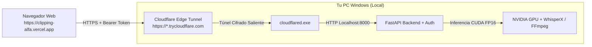

# Guía de Conexión Remota Segura — Clipping Alfa
## Conexión Vercel (Frontend) ↔ PC Local (Backend GPU) con Cloudflare Tunnel

Esta guía explica cómo conectar de forma segura la interfaz web pública alojada en **Vercel** (`https://clipping-alfa.vercel.app`) con el backend **FastAPI** ejecutándose localmente en tu PC con Windows y GPU NVIDIA, mediante un **Cloudflare Tunnel** cifrado punto a punto, sin necesidad de abrir puertos en tu router ni exponer tu IP pública.

---

## 1. Arquitectura de Seguridad



### Mecanismos de Protección:
1. **Autenticación Bearer Obligatoria:** Los endpoints sensibles (`/api/status`, `/api/process`, `/api/videos`) y el canal WebSocket (`/ws/pipeline`) exigen el token secreto configurado en `CLIPPING_API_TOKEN`.
2. **Endpoint `/health` Público:** Permite verificar rápidamente si el túnel y la GPU están activos sin comprometer datos.
3. **CORS Restrictivo:** Solo se permiten peticiones originadas desde `https://clipping-alfa.vercel.app`, dominios preview de Vercel y `localhost`.
4. **Sin Apertura de Puertos (NAT Traversal):** `cloudflared` establece una conexión TLS saliente hacia la red de Cloudflare; no requiere abrir puertos en tu router ni configurar IP estática.

---

## 2. Configuración Inicial (Solo la primera vez)

### 2.1 Crear el archivo `.env` local
Copia la plantilla `.env.example` a `.env` en la raíz del proyecto:

```powershell
cp .env.example .env
```

Edita `.env` y define tu token secreto:
```env
CLIPPING_API_TOKEN=tu_clave_secreta_super_segura_aqui_2026
ALLOWED_ORIGINS=https://clipping-alfa.vercel.app,http://localhost:5173
```

> ⚠️ **IMPORTANTE:** El archivo `.env` está en `.gitignore` y **nunca** debe subirse a GitHub.

---

## 3. Procedimiento de Arranque Diario

Para que la web pública en Vercel pueda comunicarse con tu GPU local, debes tener **2 servicios ejecutándose en tu PC**:

### Terminal 1: Iniciar el Backend FastAPI
Abre PowerShell en la raíz del proyecto y ejecuta:

```powershell
.\.venv\Scripts\python.exe run_app.py
```
> El servidor FastAPI quedará escuchando en `http://localhost:8000`.

---

### Terminal 2: Iniciar Cloudflare Tunnel
En otra ventana de PowerShell, ejecuta:

```powershell
.\.venv\Scripts\python.exe start_tunnel.py
```
*(O directamente con el binario de cloudflared: `& "C:\Program Files (x86)\cloudflared\cloudflared.exe" tunnel --url http://localhost:8000`)*.

Cloudflare mostrará una URL temporal HTTPS segura similar a:
```text
https://random-words-1234.trycloudflare.com
```

---

### Paso 3: Conectar desde la Web en Vercel

1. Abre tu web en **[https://clipping-alfa.vercel.app](https://clipping-alfa.vercel.app)**.
2. Haz clic en el botón de estado en la cabecera (o en la pestaña **Settings**).
3. Pega la URL del túnel (ej. `https://random-words-1234.trycloudflare.com`).
4. Pega tu `CLIPPING_API_TOKEN`.
5. Haz clic en **"Probar Conexión"** → Verás la confirmación con el nombre de tu tarjeta gráfica NVIDIA (ej. *GeForce RTX*).
6. Haz clic en **"Guardar Configuración"**.

*(Opcional: Si tienes un dominio propio en Cloudflare, puedes configurar un subdominio permanente como `api.tudominio.com` y configurar la variable `VITE_API_BASE_URL` en el panel de Vercel).*

---

## 4. Verificación de Funcionamiento

Puedes verificar la conectividad desde cualquier dispositivo o navegador con estos comandos:

### Healthcheck (Sin Auth):
```bash
curl https://tu-tunel.trycloudflare.com/health
# Respuesta esperada: {"status":"ok","service":"clipping-alfa-backend","gpu_available":true,...}
```

### Status Autenticado:
```bash
curl -H "Authorization: Bearer TU_TOKEN" https://tu-tunel.trycloudflare.com/api/status
```

### Intento no autorizado (Seguridad):
```bash
curl https://tu-tunel.trycloudflare.com/api/status
# Respuesta esperada: HTTP 401 Unauthorized
```

---

## 5. Resumen de Servicios Requeridos en tu PC

| Servicio | Comando | Propósito |
| :--- | :--- | :--- |
| **FastAPI Backend** | `python run_app.py` | Ejecuta Faster-Whisper, WhisperX, FFmpeg y API REST/WS |
| **Cloudflare Tunnel** | `python start_tunnel.py` | Expone de forma cifrada el puerto 8000 a internet |

Si apagas tu PC o detienes estos comandos, la interfaz en Vercel continuará funcionando normalmente en **Modo Demostración Interactivo** sin mostrar errores.
